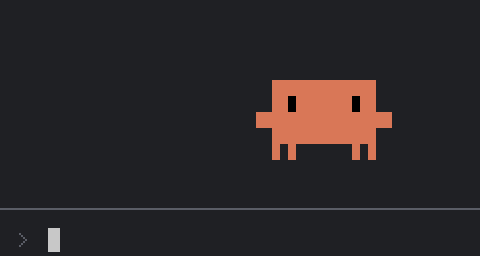
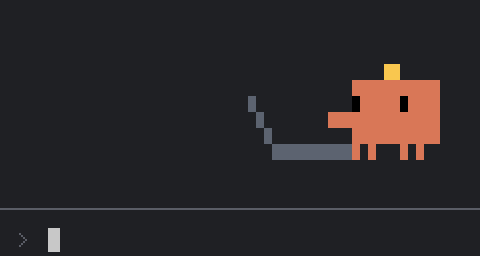
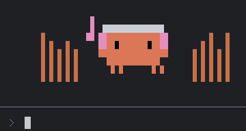
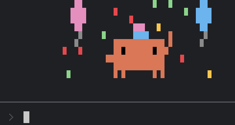

<h1 align="center">Clawd Spinner</h1>

<p align="center"><b>English</b> | <a href="README.zh-CN.md">中文</a></p>

<p align="center">
  
</p>

<p align="center">
  Bring <b>Clawd</b>, Claude Code's pixel mascot, into your terminal.<br>
  It lives above the prompt, acts out whatever Claude is doing, bubbles code while it types, dances to your music, and hops when you click it.
</p>

<p align="center">
  <a href="#install">Install</a> ·
  <a href="#commands">Commands</a> ·
  <a href="#music-mode">Music mode</a> ·
  <a href="#settings">Settings</a> ·
  <a href="#development">Development</a>
</p>

---

## What it does

<table>
  <tr>
    <td width="50%">
      <br>
      <b>Writing code</b><br>
      While Claude edits a file, Clawd sits side on at a little laptop, typing away, with bits of code like <code>{}</code> <code>&lt;/&gt;</code> <code>;</code> bubbling up from its head.
    </td>
    <td width="50%">
      <br>
      <b>Thinking · Reading · Running · Searching</b><br>
      Its pose follows the tool Claude is using: thought dots while it thinks, a page held up while it reads, a run while a command runs, a magnifying glass while it searches.
    </td>
  </tr>
  <tr>
    <td width="50%">
      <br>
      <b>Music mode</b><br>
      Headphones on, it bounces to the beat of whatever your Mac is playing, with notes floating up from its ear cups.
    </td>
    <td width="50%">
      <br>
      <b>Celebrations</b><br>
      When an answer took more than 5 seconds, it ends with a party or fireworks, picked at random.
    </td>
  </tr>
</table>

And a few small touches:

- **Always there**: while Claude waits for you, Clawd stands at the right end of the prompt, blinking and glancing around now and then.
- **Click it**: it hops with its arms up, winks its right eye, glances to each side, and rolls its eyes all around.
- **Not selectable**: dragging to select text never picks up Clawd, so it never ends up in what you copy.
- **Plain captions**: beside it reads something like "Editing… · register.js". Only the file's name is shown, never anything else from a tool's input.
- **English and Chinese**: follows your system language, or pick one yourself.
- **Free**: calls no model and uses no network.

## Install

You need:

- **Claude Code 2.1.287 or later**, the first version that supports mods.
- **The terminal**. The Desktop app keeps its own spinner and shows no Clawd.
- For **music mode** only: macOS 14.2 or later, and the Xcode command line tools (`xcode-select --install`).

### From the plugin marketplace

In Claude Code, add this repository as a marketplace, then install the plugin from it:

```
/plugin marketplace add zhanbodev/clawd-spinner
```

```
/plugin install clawd-spinner@clawd-spinner
```

Or from your shell:

```bash
claude plugin marketplace add zhanbodev/clawd-spinner
```

```bash
claude plugin install clawd-spinner@clawd-spinner
```

Clawd appears in your next session. To get a newer release later:

```bash
claude plugin marketplace update clawd-spinner && claude plugin update clawd-spinner@clawd-spinner
```

### From source

To hack on it, clone it and start Claude Code with `--plugin-dir`:

```bash
git clone https://github.com/zhanbodev/clawd-spinner.git ~/mods/clawd-spinner
```

```bash
claude --plugin-dir ~/mods/clawd-spinner
```

To load your copy in every session without the flag, add this to `~/.claude/settings.json`, with your own absolute path:

```json
{
  "env": {
    "CLAUDE_CODE_PLUGIN_DIRS": "/Users/you/mods/clawd-spinner"
  }
}
```

Changes to the code reload by themselves, with no restart.

## Commands

Type them in Claude Code. They work while Claude is answering, too.

| Command | What it does |
| :-- | :-- |
| `/clawd-spinner show` | Brings Clawd back |
| `/clawd-spinner hidden` | Hides Clawd. It stays hidden in later sessions too |
| `/clawd-spinner startmusic` | Turns music mode on |
| `/clawd-spinner stopmusic` | Turns music mode off |

## Music mode

**Turn it on**

1. Play some music, then run `/clawd-spinner startmusic`. The first time, it takes a few seconds to build the small program that listens.
2. macOS asks whether **clawd-ears may record system audio**. Click Allow.
3. Clawd puts its headphones on and starts dancing to the beat.

**No prompt, or you clicked Don't Allow?**

Open **System Settings → Privacy & Security → Screen & System Audio Recording**, find **clawd-ears** in the "System Audio Recording Only" list below, and switch it on. Then run `/clawd-spinner stopmusic` and `/clawd-spinner startmusic`.

**What it hears**

- It reads what your Mac is playing through Core Audio. It **never uses the microphone**.
- Every 50 ms it works out only how loud the sound is, and whether a beat landed. The audio itself is never saved or sent, and never leaves that small program.
- The program runs only while music mode is on, and quits the moment you turn it off. It uses about 22 MB of memory and close to no CPU.

## Settings

In `/config`, find **Language / 语言**:

| Value | Effect |
| :-- | :-- |
| `auto` (default) | Follows your system language: Chinese when the first of `LC_ALL`, `LC_MESSAGES` and `LANG` that's set starts with `zh`, English otherwise |
| `zh` | Chinese |
| `en` | English |

## How it's drawn

- Clawd is drawn with quadrant block characters (`▘ ▝ ▀ ▖ ▌ ▞ ▛ ▗ ▚ ▐ ▜ ▄ ▙ ▟ █`), four pixels to a character cell, the way Claude Code draws its own logo. Its shape is copied pixel for pixel from that logo.
- It's drawn in the mod band above the prompt, inside a `Client` region. A press on the region goes to Clawd, so it can answer clicks and can't be selected.
- A frame lasts 150 ms. Clawd redraws every frame only while it works, celebrates, dances or reacts to a click. While it waits, it redraws only when it blinks or glances.

## Development

```bash
claude plugin validate .        # Static check: the events and APIs the mod uses
```

```
clawd-spinner/
├── .claude-plugin/
│   ├── plugin.json              Manifest: name, version, the language setting
│   └── marketplace.json         Makes this repository a marketplace you can install from
├── hooks/
│   ├── hooks.json               Points to register.js
│   ├── register.js              Every animation and all the logic
│   └── clawd-view.js            The Client module that shows Clawd and takes clicks
├── native/
│   ├── clawd-ears.swift         The program music mode listens with
│   └── Info.plist               The reason it gives when it asks to record system audio
├── docs/images/                 The animations in this README
├── tests/                       Tests for claude plugin test
└── HANDOFF.md                   Design notes, pitfalls and open items (in Chinese)
```

The design choices, what each version changed, and what's still untested are in [HANDOFF.md](HANDOFF.md).

## Note

Clawd is the mascot of Anthropic's Claude Code. This is an unofficial mod made by a fan, not a product of Anthropic.
